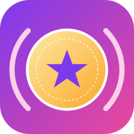
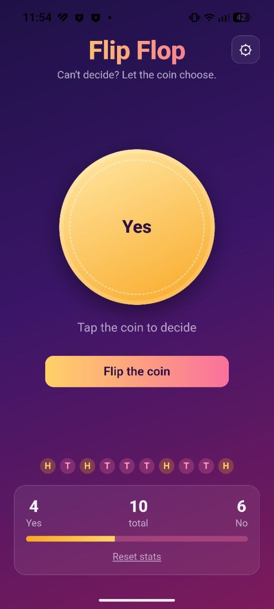
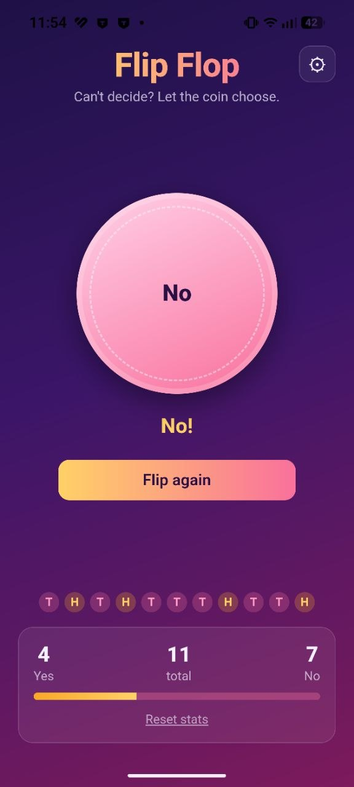

<div align="center">



# Flip Flop

### Can't decide? Let the coin choose.

A playful decision-maker with a satisfying 3D coin flip, custom choices, and a running history of every result.

[](https://react.dev/)
[](https://www.typescriptlang.org/)
[](https://vite.dev/)
[](https://web.dev/progressive-web-apps/)
[](https://capacitorjs.com/)

</div>

## One tap. One answer.

Flip Flop turns indecision into a quick, delightful interaction. Name the two sides anything you like, tap the coin, and get a fair 50/50 answer. Your recent flips and overall split stay visible so every decision has a history.

<table>
  <tr>
    <td align="center" width="50%">
      
      <br />
      <strong>Make it your decision</strong>
      <br />Customize both sides, then tap the coin.
    </td>
    <td align="center" width="50%">
      
      <br />
      <strong>Get an instant answer</strong>
      <br />See the result and flip again whenever you need.
    </td>
  </tr>
</table>

## Highlights

- **Satisfying 3D flip** — a polished coin animation makes every choice feel tangible.
- **Fair outcomes** — every flip has a true 50/50 chance.
- **Your choices, your labels** — replace Heads and Tails with anything from “Pizza / Sushi” to “Go / Stay.”
- **Decision history** — scan recent outcomes and see the running ratio at a glance.
- **Persistent stats** — results are saved locally between sessions.
- **Works everywhere** — use it in the browser, install it as an offline-ready PWA, or build the Android app.

## Quick start

### Web

Requires [Node.js 22](https://nodejs.org/) and npm. The required Node version is recorded in `.nvmrc`.

```bash
nvm install
nvm use
npm install
npm run dev
```

Open the local URL printed by Vite.

### Production build

```bash
npm run build
npm run preview
```

The production-ready PWA is written to `dist/`. Deploy that folder to any static host, including GitHub Pages, Netlify, or Vercel.

## Android app

The native Android project is included in `android/` and powered by [Capacitor](https://capacitorjs.com/).

### Build with GitHub Actions

Every push to `main` builds a debug APK. You can also run it manually from **Actions → Build Android APK → Run workflow** and download the generated artifact—no local Android SDK required.

### Build locally

Install JDK 17 or newer and [Android Studio](https://developer.android.com/studio) with Android SDK Platform 36, Build-Tools, and Platform-Tools. Set `ANDROID_HOME`, or add your SDK path to `android/local.properties`:

```properties
sdk.dir=/path/to/your/Android/sdk
```

Then build the app:

```bash
nvm use
npm install
npm run android:build
```

The APK is created at:

```text
android/app/build/outputs/apk/debug/app-debug.apk
```

Install it on a connected device with USB debugging enabled:

```bash
adb install -r android/app/build/outputs/apk/debug/app-debug.apk
```

To work in Android Studio instead:

```bash
npm run android:open
```

After changing the web app, run `npm run cap:sync` before rebuilding Android.

## Tech stack

| Layer | Technology |
| --- | --- |
| Interface | React 19 + TypeScript |
| Tooling | Vite 8 |
| Installable web app | vite-plugin-pwa |
| Android shell | Capacitor 8 |
| Local persistence | Web Storage API |

## Useful commands

| Command | Purpose |
| --- | --- |
| `npm run dev` | Start the development server |
| `npm run build` | Type-check and build the PWA |
| `npm run preview` | Preview the production build |
| `npm run lint` | Run the linter |
| `npm run cap:sync` | Build and sync web assets to Android |
| `npm run android:build` | Create a debug APK |
| `npm run android:open` | Open the native project in Android Studio |

<div align="center">

**Next time you're stuck between two choices, flip it.**

</div>
